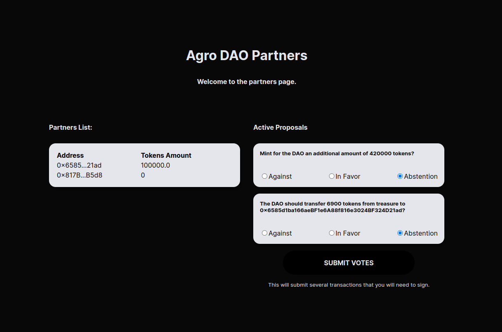

## Agro DAO - A Decentralized Crowdfunding

Join this DAO to be part of agribusiness investments.

### Summary

A Decentralized Autonomous Organization (DAO) is an entity with no central leadership. Decisions are made from the bottom up, governed by a community organized around a set of rules validated by a blockchain.

To be a partner you need to mint an NFT. In this DAO partners can approve or not proposals through the governance token and governance contract.

### Smart Contracts

The contracts are built using thirdweb so we can write them using just javascript.

The first is an [ERC-1155](https://goerli.etherscan.io/address/0x8E970a8e599B14f20411C8A5E06899bd9Ff4C9e3) that allows multiple people to hold the same NFT. This is more effective in comparison a taxes of an ERC-721 where all NFTs are unique, and for our business is not appropriate because we want to only have an [NFT](https://testnets.opensea.io/collection/agrodao-collection) for all partners.

The second contract is an [ERC-20](https://goerli.etherscan.io/token/0x8C8157f04C2B4d47F9f498C4FBF0c37C613E5624) this is an Ethereum token pattern. Our token is named $AGRO and has an initial amount of 1,000,000. We can do a token airdrop for all NFT holders.

The third is a [governance contract](https://goerli.etherscan.io/token/0xA195CaE00E3E5BACD52eA7065eb4A69811644B46) where partners can vote and open new proposals. For example: open a proposal to pay a developer that helped the DAO on a website, if there is a minimum quantity of tokens used this proposal will be approved.

### Run the project

If you want to deploy new contracts and run the project:

- Fill out .env;
- Node 12+ is mandatory;
- Run `node scripts/1-initialize-sdk.js`;
- Run `node scripts/2-deploy-drop.js`;
- Get the address of ERC-1155 contract in previous step and fill out on script number 3;
- Run `node scripts/3-config-nft.js`;
- Get the same address of ERC-1155 contract and fill out on script number 4;
- Run `node scripts/4-set-claim-condition.js`;
- Run `node scripts/5-deploy-token.js`;
- Get the address of ERC-20 contract in previous step and fill out on script number 6;
- Run `node scripts/6-print-money.js`;
- Fill out on script 7 the ERC-20 and ERC-1155 addresses;
- Run `node scripts/7-airdrop-token.js` to make the airdrop;
- Fill out on script 8 the ERC-20 address;
- Run `node scripts/8-deploy-vote.js` to create a voting contract;
- Fill out on script 9 the ERC-20 and voting contract addresses;
- Run `node scripts/9-setup-vote.js` to transfer tokens to governance contract;
- Fill out on script 10 the ERC-20 and voting contract addresses;
- Run `node scripts/10-create-vote-proposals.js` to create new proposals;
- Fill out on script 11 the ERC-20 contract address;
- Run `node scripts/11-revoke-roles.js` to revoke wallet privileges;
- Fill out the ERC-20, ERC-1155 and voting contract addresses on App.jsx;
- Run `npm install`;
- Run `npm start`.
